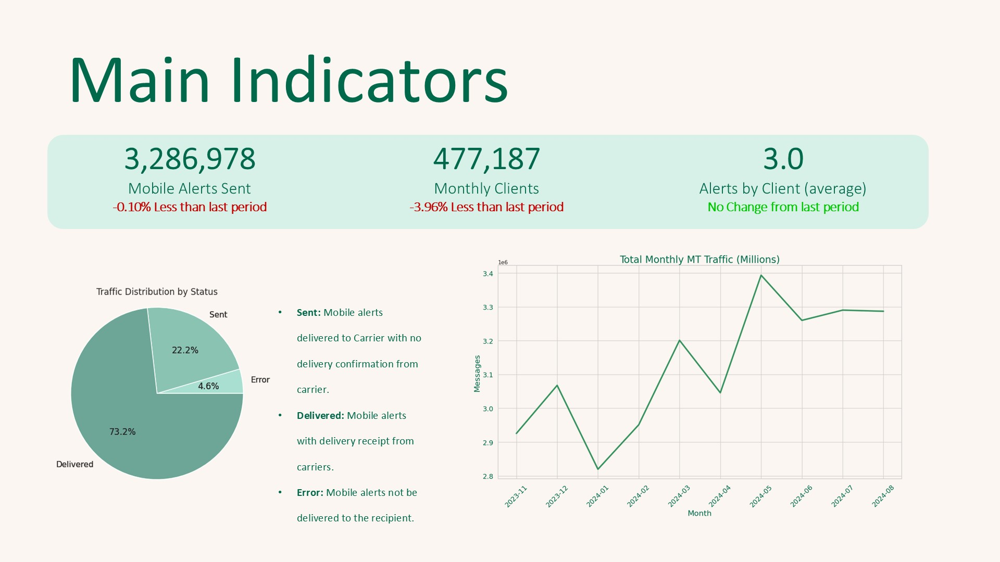

# Sample Dashboard - Main indicators

The following image shows the result of an automatic process that included:
* Gather all required data fields from database.
* Calculate the required operation KPIs
* Generate visualization charts
* Include visualizations and KPIs into a PowerPoint presentation template
* Export the presentation as pdf
* Deliver the pdf by email

The presentation contains more slides that can't be shared on this github page, but the reader can have an idea of design principles employed on this example.

